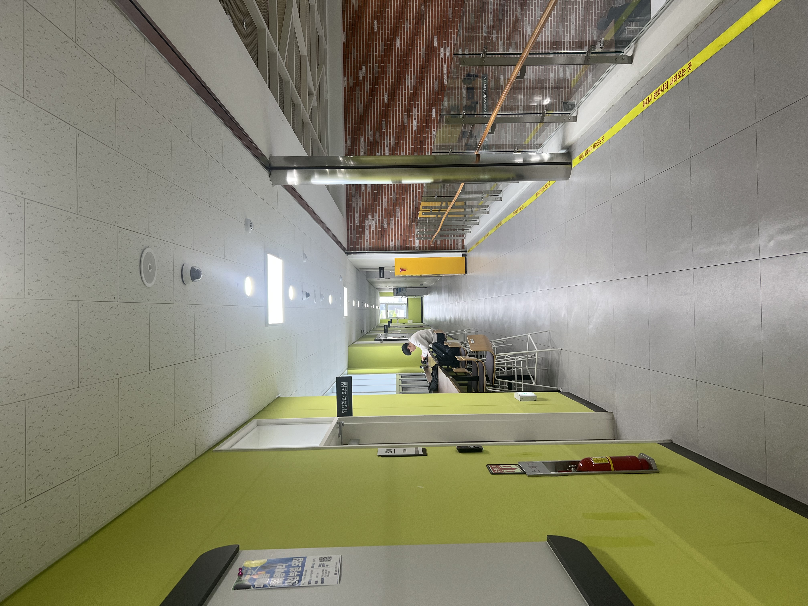
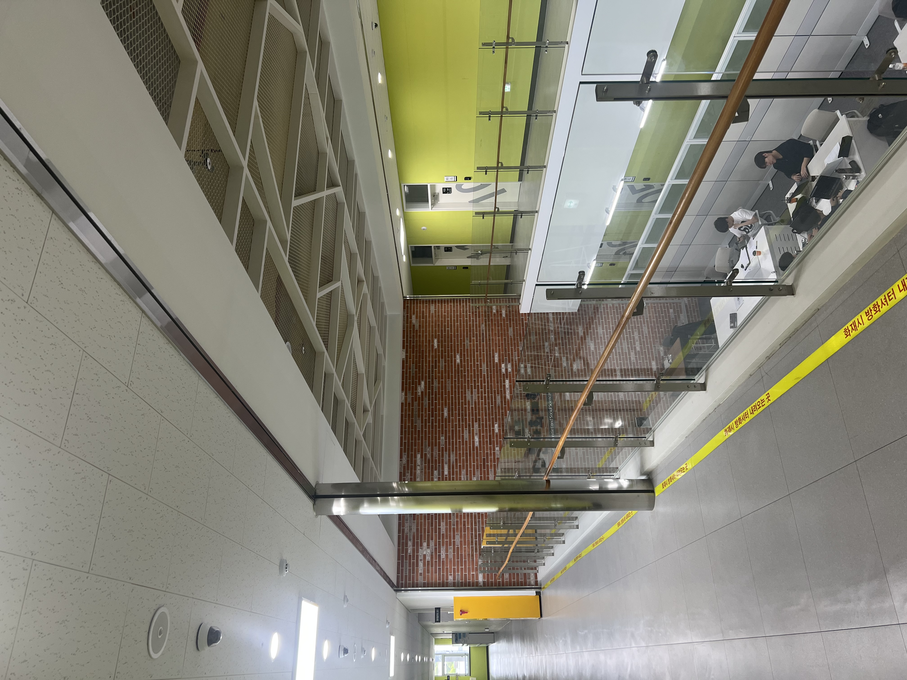
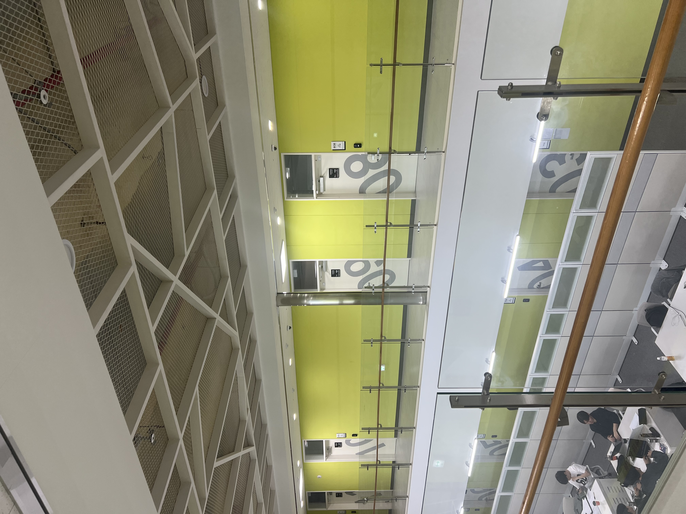
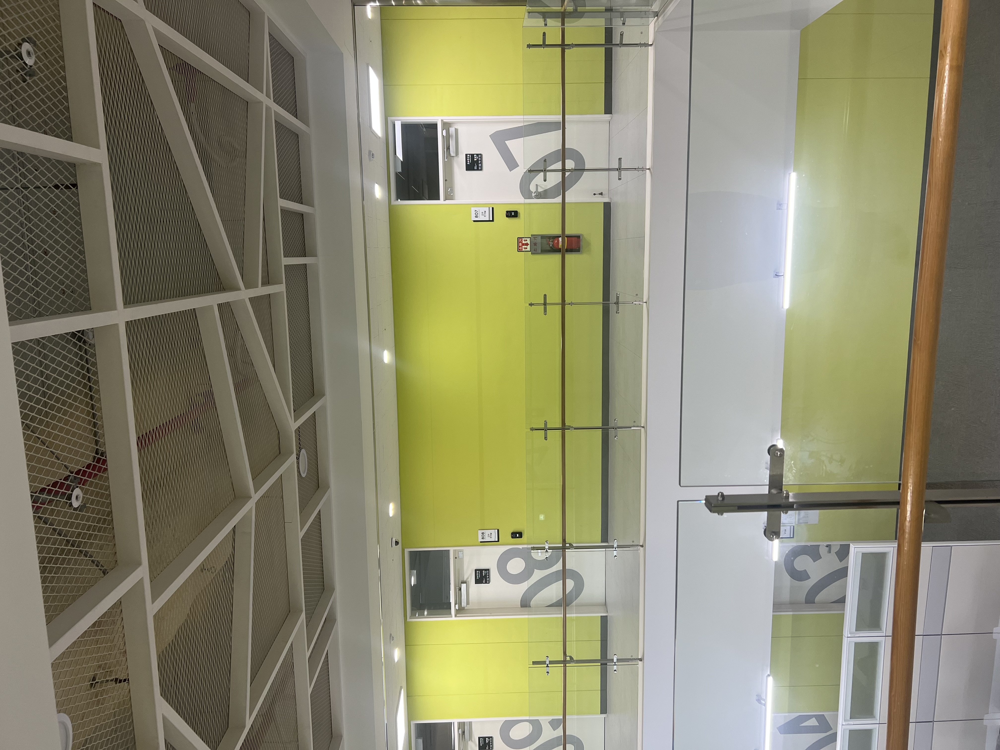

# PanoStitch 

An automatic panorama generation tool from overlapping images. This project is implemented from scratch using OpenCV primitives, **without using `cv2.Stitcher` or any other high-level stitching APIs.

---

##  Results

### Input Images
|        Image 1        |        Image 2        |        Image 3        |        Image 4        |
|:---------------------:|:---------------------:|:---------------------:|:---------------------:|
|  |  |  |  |

### Final Panorama


---

##  Features

| Feature | Description |
| :--- | :--- |
| **SIFT / ORB Detection** | Choose between scale-invariant (SIFT) or fast binary (ORB) descriptors. |
| **Lowe's Ratio Test** | Robust nearest-neighbor filtering (default ratio = 0.7) for feature matching. |
| **RANSAC Homography** | Outlier-robust planar transformation estimation using RANSAC. |
| **Multi-band Blending** | Seamless intensity transitions using Laplacian pyramids to eliminate seams.  |
| **Cylindrical Projection** | Reduces distortion for wide, rotation-based panoramas by warping images to a cylindrical surface.  |
| **Middle-Image Referencing** | Uses the center image as an anchor to minimize accumulated distortion. |


---
## Futurework
-
Seam-Cutting: Implementing an optimal cut-line search (Seam-finding) to completely avoid blending artifacts in overlapping regions.
Bundle Adjustment: Applying global optimization across all image parameters simultaneously to eliminate accumulated registration errors.
---
## TIPS
Ensure 30-50% overlap between consecutive frames for reliable matching.
For planar stitching, ensure the scene has minimal depth variation.
If stitching fails, increase image overlap or use the SIFT method for higher accuracy.

---
## Usage

This program is executed via the command line. You must provide the paths to the images you wish to stitch. For optimal results, ensure the images are provided in **left-to-right** sequential order.

### Basic Execution
Run the script with default settings (SIFT and Multi-band blending):
```bash
python image_stitching.py img1.jpg img2.jpg img3.jpg img4.jpg img5.jpg
